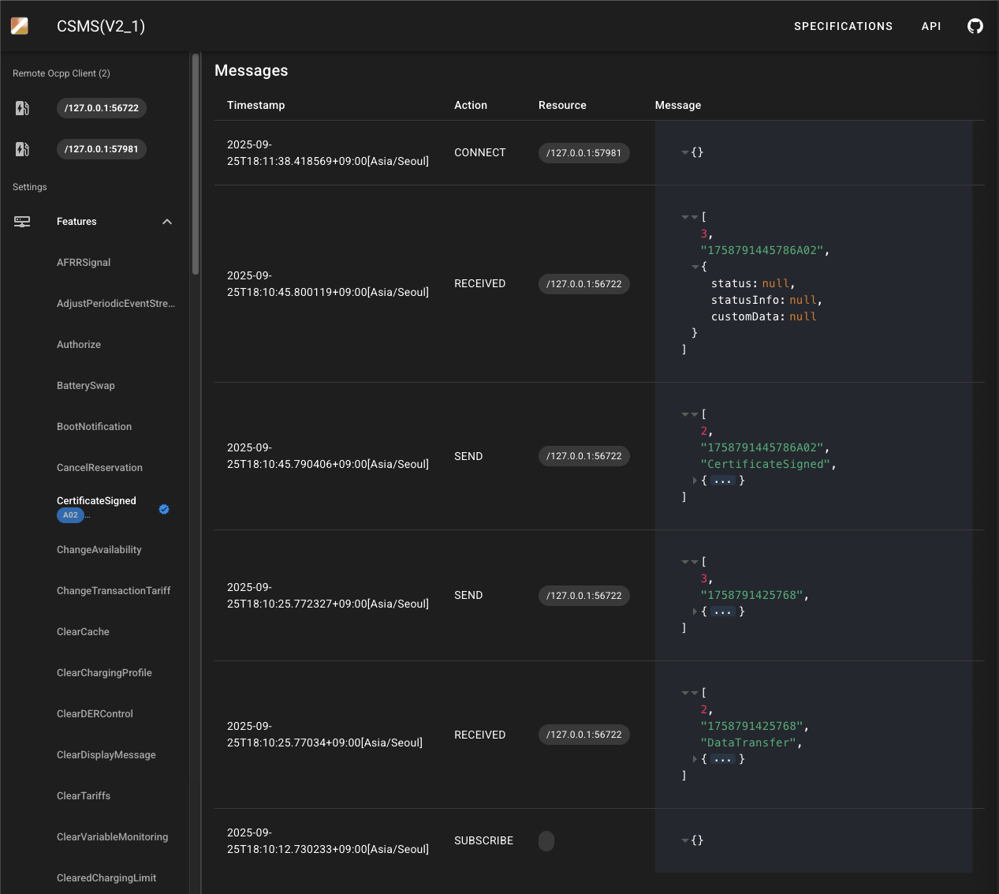

# ocpp-boot-server
OCPP server sample implementation based on spring-boot.

All messages for all versions of OCPP are written in Java.

If you want to customize a businiss logic, implement the corresponding server handler.

# Usage 

```bash
./mvnw spring-boot:run
```

# Admin UX 

> http://localhost:8081




# Customize Handler  

```java
import io.u2ware.ocpp.v2_1.exception.*;
import io.u2ware.ocpp.v2_1.handlers.*;
import io.u2ware.ocpp.v2_1.messaging.*;
import io.u2ware.ocpp.v2_1.model.*;

@Component //-> 2.
public class MyDataTransfer implements CSMSHandler { //-> 1.

    @Override/** DataTransfer [1/4] */
    public DataTransferRequest sendDataTransferRequest(
        String id, Map<String, Object> req) {
        return DataTransferRequest.builder().build();
    }

    @Override/** DataTransfer [3/4] */
    public void receivedDataTransferResponse(
        String id, DataTransferResponse res, ErrorCode err) {
    }

    @Override/** DataTransfer [2/4] */
    public DataTransferResponse receivedDataTransferRequest(
        String id, DataTransferRequest req) {
        if(ObjectUtils.isEmpty(req)) {  // your logic...
            throw ErrorCodes.GenericError.exception("your error message"); //-> 3.
        }
        return DataTransferResponse.builder().build();
    }

    @Override/** DataTransfer [4/4] */
    public void sendDataTransferResponse(
        String id, DataTransferResponse res, ErrorCode err) {
    }
}
```
1. Implement a Server Handler according to OCPP messages. 
2. Declare @Component so that scans the beans.
3. <i>OCPP CALL ERROR</i> messages can be sent by throwing an error code. 


# Test without I/O

```java
import io.u2ware.ocpp.v2_1.exception.*;
import io.u2ware.ocpp.v2_1.handlers.*;
import io.u2ware.ocpp.v2_1.messaging.*;
import io.u2ware.ocpp.v2_1.model.*;

@SpringBootTest
class MyDataTransferHandlerTests {

  	protected @Autowired ApplicationContext ac;
	protected @Autowired CSMSTransport ocppTransport;

    @Test
    void context1Loads() throws Exception {

        /////////////////////////////////////
        // Mock Object
        /////////////////////////////////////
		ChargingStationTransport mockTransport 
			= new ChargingStationTransport("mockTransport"); //-> 1
		
		MockWebSocketHandlerInvoker.of(ac)
			.connect(ocppTransport, mockTransport); //-> 2
		
		Thread.sleep(1000);	

		/////////////////////////////////////
		// Test without I/O
		/////////////////////////////////////
        CSMSCommand command 
            = CSMSCommand.ALL.DataTransfer.build();
        ocppTransport.offer(command); //-> 3

        Thread.sleep(1000);
    }
}
```
1. Make mock client object.
2. Connecting mock object with your server bean. 
3. send server command.


# Customize Usecase    
```java
import io.u2ware.ocpp.v2_1.exception.*;
import io.u2ware.ocpp.v2_1.handlers.*;
import io.u2ware.ocpp.v2_1.messaging.*;
import io.u2ware.ocpp.v2_1.model.*;

@Component 
public class SecurityA02ServerHandler implements 
    TriggerMessage.CSMSHandler,
    SignCertificate.CSMSHandler, 
    CertificateSigned.CSMSHandler
    {

    protected @Autowired CSMSTransport ocppTransport; //

    @Override
    public String usecase() {
        return "A02"; //
    }

    @Override/** TriggerMessage [1/4] */
    public TriggerMessageRequest sendTriggerMessageRequest(
        String id, Map<String, Object> req) {
        return TriggerMessageRequest.builder().build();
    }   

    @Override/** TriggerMessage [3/4] */
    public void receivedTriggerMessageResponse(
        String id, TriggerMessageResponse res, ErrorCode err) {
    }

    @Override/** SignCertificate [2/4] */
    public SignCertificateResponse receivedSignCertificateRequest(
        String id, SignCertificateRequest req) {
        return SignCertificateResponse.builder().build();
    }

    @Override/** SignCertificate [4/4] */
    public void sendSignCertificateResponse(
        String id, SignCertificateResponse res, ErrorCode err) {
        ///////////////////////////////////////////////////////////////
        // You can send other OCPP CALL messages using 'ocppTemplate'.
        ///////////////////////////////////////////////////////////////
        CSMSCommand command = 
            CSMSCommand.ALL.CertificateSigned.buildWith("A02");
        ocppTransport.offer(command, id); //
    }

    @Override/** CertificateSigned [1/4] */
    public CertificateSignedRequest sendCertificateSignedRequest(
        String id, Map<String, Object> req) {
        return CertificateSignedRequest.builder().build();
    }  

    @Override/** CertificateSigned [3/4] */
    public void receivedCertificateSignedResponse(
        String id, CertificateSignedResponse res, ErrorCode err) {
    }
}
```


# @EnableOcppServer 

```java
@SpringBootApplication 
@EnableOcppServer(               //-> 3. 
    version = OCPPVersion.V2_1,  //-> 2. 
	uri = "/your_ocpp"           //-> 1. 
)
public class Application {
	public static void main(String[] args) {
		SpringApplication.run(Application.class, args);
	}
}
```
1. URI. ocpp clients can connect via URL.(ws://localhost:18080/your_ocpp)

2. versions. V2_1, V2_0_1, V1_6

3. automatically registers the 'ocppTransport' beans according to version:

|version|beanClass|Description|
|------|:---|---|
|v2.1 | [CCMSTransport]()| An object that can offer a [CCMSCommand]().|
|v2.0.1 | [CCMSTransport]()| An object that can offer a [CCMSCommand]().|
|v1.6 | [CentralSystemTransport]() | An object that can offer a [CentralSystemCommand]().|


# Core Concept 


* v2.1

|participant|object|
|------|:---|
|Offer / Answer| [CSMSHandler]() or [ChargingStationHandler]() |
|Sender / Receiver |[CSMSSession]() or [ChargingStationSession]() |
|Transport |[CSMSTransport]()  or [ChargingStationTransport]() |


* v2.0.1

|participant|object|
|------|:---|
|Offer / Answer| [CSMSHandler]() or [ChargingStationHandler]() |
|Sender / Receiver |[CSMSSession]() or [ChargingStationSession]() |
|Transport |[CSMSTransport]()  or [ChargingStationTransport]() |

* v1.6

|participant|object|
|------|:---|
|Offer / Answer| [CentralSystemHandler]() or [ChargePointHandler]() |
|Sender / Receiver |[CentralSystemSession]() or [ChargePointSession]() |
|Transport |[CentralSystemTransport]()  or [ChargePointTransport]() |
