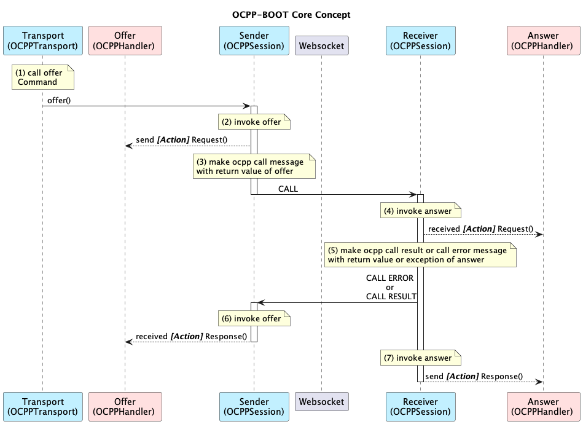

# ocpp-boot-server
OCPP server implementation based on spring-boot.

All messages for all versions of OCPP are written in Java.

If you want to customize a businiss logic, implement the corresponding server handler.

# Usage 

```bash
./mvnw spring-boot:run
```

# Admin UX (Preparing)

> http://localhost:8081


# Customize   

```java
import io.u2ware.ocpp.v2_1.exception.ErrorCodes; //-> 3.
import io.u2ware.ocpp.v2_1.handlers.DataTransfer.CSMSHandler; //-> 2.

@Component //-> 1.
public class MyDataTransfer implements CSMSHandler { //-> 2.

    @Override/** DataTransfer [1/4] */
    public DataTransferRequest sendDataTransferRequest(
        String id, Map<String, Object> req) {

        return DataTransferRequest.builder().build();
    }

    @Override/** DataTransfer [3/4] */
    public void receivedDataTransferResponse(
        String id, DataTransferResponse res, ErrorCode err) {

    }

    @Override/** DataTransfer [2/4] */
    public DataTransferResponse receivedDataTransferRequest(
        String id, DataTransferRequest req) {

        if(ObjectUtils.isEmpty(req)) {  // your logic...
            throw ErrorCodes.GenericError.exception("your error message"); //-> 3.
        }
        return DataTransferResponse.builder().build();
    }

    @Override/** DataTransfer [4/4] */
    public void sendDataTransferResponse(
        String id, DataTransferResponse res, ErrorCode err) {

    }
}
```

```java
import io.u2ware.ocpp.v2_1.handlers.RequestStartTransaction; //-> 2.
import io.u2ware.ocpp.v2_1.handlers.UnlockConnector; //-> 2.
import io.u2ware.ocpp.v2_1.messaging.CSMSCommandOperations; //-> 4.

@Component  //-> 1.
public class MyCustomHandler implements 
    UnlockConnector.CSMSHandler, //-> 2.
    RequestStartTransaction.CSMSHandler //-> 2.
    {  

    protected @Autowired CSMSCommandOperations operations; //-> 4.

    @Override
    public String usecase() {
        return "MyCustomHandler";
    }

    @Override/** MyCustomHandler [1/8] */
    public UnlockConnectorRequest sendUnlockConnectorRequest(
        String id, Map<String, Object> req) {

        return UnlockConnectorRequest.builder().build();
    }

    @Override/** MyCustomHandler [3/8] */
    public void receivedUnlockConnectorResponse(
        String id, UnlockConnectorResponse res, ErrorCode err) {

        CSMSCommand command = 
            CSMSCommand.ALL.RequestStartTransaction.buildWith("MyCustomHandler");
        
        operations.send(id, command); //-> 4.            
    }

    @Override/** MyCustomHandler [5/8] */
    public RequestStartTransactionRequest sendRequestStartTransactionRequest(
        String id, Map<String, Object> req) {

        return RequestStartTransactionRequest.builder().build();        
    } 

    @Override/** MyCustomHandler [7/8] */
    public void receivedRequestStartTransactionResponse(
        String id, RequestStartTransactionResponse res, ErrorCode err) {   


    }
}
```
1. Declare @Component so that 'ocppInitializer' scans the beans.
2. Implement a Server Handler according to OCPP messages. 
3. <i>OCPP CALL ERROR</i> messages can be sent by throwing an error code. 
4. You can send other <i>OCPP CALL</i> messages using 'ocppTemplate'.

# Test without I/O

```java
import io.u2ware.ocpp.client.MockWebSocketHandlerInvoker; //-> 2
import io.u2ware.ocpp.v2_1.messaging.CSMSCommandTemplate; 
import io.u2ware.ocpp.v2_1.messaging.ChargingStationCommandTemplate; //-> 1

@SpringBootTest
class ApplicationTests {

    protected @Autowired ApplicationContext ac;

    protected @Autowired CSMSCommandTemplate serverTemplate;

    @Test
    void context1Loads() throws Exception {

        /////////////////////////////////////
        // Test without I/O
        /////////////////////////////////////
        ChargingStationCommandTemplate mockClientTemplate 
            = new ChargingStationCommandTemplate("mockClientTemplate"); //-> 1

        MockWebSocketHandlerInvoker.of(ac)
            .connect(serverTemplate, mockClientTemplate); //-> 2
            
        Thread.sleep(1000);	

        /////////////////////////////////////
        // 
        /////////////////////////////////////
        CSMSCommand command 
            = CSMSCommand.ALL.UnlockConnector.buildWith("MyCustomHandler");
        serverTemplate.send(command);

        Thread.sleep(1000);
    }
}
```
1. Make mock client object.
2. Connecting mock object with your server bean. 


# @EnableOcppServer 

```java
@SpringBootApplication 
@EnableOcppServer(               //-> 3. 
    version = OCPPVersion.V2_1,  //-> 2. 
	uri = "/your_ocpp"           //-> 1. 
)
public class Application {
	public static void main(String[] args) {
		SpringApplication.run(Application.class, args);
	}
}
```
1. URI. ocpp clients can connect via URL.(ws://localhost:18080/your_ocpp)

2. versions. V2_1, V2_0_1, V1_6

3. [@EnableOcppServer]() automatically registers the following beans:


    * v2.1

	|beanName|beanClass|Description|
	|------|:---|---|
	|ocppOperations | [CCMS]()| An object that can offer and answer OCPP version 2.1 message.|
	|ocppTemplate | [CCMSCommandOperations]()| An object that can send a [CCMSCommand]().|
	|ocppInitializer | [CCMSInitializer]()| Scan for a [CCMSHandler]() that register it in [CCMS]().|


    * v2.0.1

	|beanName|beanClass|Description|
	|------|:---|---|
	|ocppOperations | [CCMS]()| An object that can offer and answer OCPP version 2.0.1 message.|
	|ocppTemplate | [CCMSCommandOperations]()| An object that can send a [CCMSCommand]().|
	|ocppInitializer | [CCMSInitializer]()| Scan for a [CCMSHandler]() that register it in [CCMS]().|

    * v1.6

	|beanName|beanClass|Description|
	|------|:---|---|
	|ocppOperations | [CentralSystem]()| An object that can offer and answer OCPP version 1.6 message.|
	|ocppTemplate | [CentralSystemCommandOperations]() | An object that can send a [CentralSystemCommand]().|
	|ocppInitializer | [CentralSystemInitializer]()| Scan for a [CentralSystemHandler]() that register it in [CentralSystem]().|


# Core Concept 


* v2.1

|participant|object|
|------|:---|
|Command |[CSMSCommandOperations]()  or [ChargingStationCommandOperations]() |
|Offer | [CSMSHandler]() or [ChargingStationHandler]() |
|Sender |[CSMS]() or [ChargingStation]() |
|Receiver |[CSMS]() or [ChargingStation]() |
|Answer | [CSMSHandler]() or [ChargingStationHandler]() |


* v2.0.1

|participant|object|
|------|:---|
|Command |[CSMSCommandOperations]()  or [ChargingStationCommandOperations]() |
|Offer | [CSMSHandler]() or [ChargingStationHandler]() |
|Sender |[CSMS]() or [ChargingStation]() |
|Receiver |[CSMS]() or [ChargingStation]() |
|Answer | [CSMSHandler]() or [ChargingStationHandler]() |


* v1.6

|participant|object|
|------|:---|
|Command |[CentralSystemCommandOperations]()  or [ChargePointCommandOperations]() |
|Offer | [CentralSystemHandler]() or [ChargePointHandler]() |
|Sender |[CentralSystem]() or [ChargePoint]() |
|Receiver |[CentralSystem]() or [ChargePoint]() |
|Answer | [CentralSystemHandler]() or [ChargePointHandler]() |

